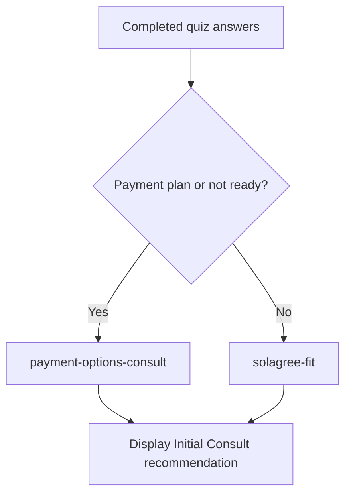

# Solagree Quiz Answers and Results Matrix

This document describes the current quiz behavior in the website code as of July 31, 2026.

Source files:

- `app/data/quiz-schema.ts` defines questions, answers, and conditional visibility.
- `app/utils/quiz-results.ts` defines final result routing.
- `app/data/quiz-policies.ts` defines non-blocking policy metadata.
- `app/data/quiz-results.ts` defines the single displayed recommendation.

## Displayed Recommendation

Every completed path displays the same recommendation:

| Displayed title | Primary CTA | Destination |
| --- | --- | --- |
| You look like a fit for a Solagree consult. | Book a Solagree consult | `/book-a-solagree-consult` |

The result screen does not display an Attorney Consult recommendation or a General Help/resource block.

## Internal Evaluation Outcomes

Evaluation IDs remain available for analytics, but they do not change the displayed recommendation.

| Priority | Condition | Result |
| --- | --- | --- |
| 1 | `paymentReadiness = need-payment-plan` | `payment-options-consult` |
| 2 | `paymentReadiness = not-ready` | `payment-options-consult` |
| 3 | Any remaining completed path | `solagree-fit` |

## Decision Flow

## Question Matrix

| Question | Answer | Visible when | Direct result impact | Metadata impact |
| --- | --- | --- | --- | --- |
| Where will your divorce be filed? | Any state | Always | None | Stores selected state. Adds deferred policy ID `state-specific-result-messaging`, but this does not block or change the result. |
| Do you have children under 21? | Yes | Always | None | Enables parenting screener. |
| Do you have children under 21? | No | Always | None | Hides parenting screener and parenting details. |
| Do you need help working through parenting, custody, or child-support issues? | Yes | Only when children = yes | None | Adds tag `parenting`. If financial screener is also yes, adds tag `both`. |
| Do you need help working through parenting, custody, or child-support issues? | No | Only when children = yes | None | No result or tag impact. |
| Which parenting topics apply to your situation? | Any selected topic | Only when children = yes and parenting screener = yes | None | Stores selected parenting topic IDs. |
| Do you have financial questions about your divorce? | Yes | Always | None | Adds tag `financial`. If parenting concerns also exist, adds tag `both`. Enables financial details. |
| Do you have financial questions about your divorce? | No | Always | None | Hides financial details. |
| Which financial topics apply to your situation? | Any selected topic | Only when financial screener = yes | None | Stores selected financial topic IDs and adds tag `financial-complexity`. |
| Do you have contact information for your spouse (we will not ask you to provide it at this time)? | Yes / `direct-contact` | Always | Allows quiz to continue to spouse cooperation. No direct result. | Stores spouse contact. |
| Do you have contact information for your spouse (we will not ask you to provide it at this time)? | No / `cannot-find` | Always | None | Adds tag `missing-spouse`. |
| Do you have contact information for your spouse (we will not ask you to provide it at this time)? | Not Sure / `unknown-whereabouts` | Always | None | Adds tag `missing-spouse`. |
| Do you expect your spouse to cooperate in the divorce process? | Yes | Only when spouse contact = direct-contact | None | Stores spouse cooperation. |
| Do you expect your spouse to cooperate in the divorce process? | No | Only when spouse contact = direct-contact | None | Adds tag `spouse-resistance`. |
| Do you expect your spouse to cooperate in the divorce process? | I am not sure yet | Only when spouse contact = direct-contact | None | Stores spouse cooperation. |
| Do you think you need legal advice before moving forward? | Yes | Always | None | Adds tag `legal-advice-needed`. |
| Do you think you need legal advice before moving forward? | No | Always | None | Stores legal advice answer. |
| Do you think you need legal advice before moving forward? | I am not sure | Always | None | Adds tag `legal-advice-needed`. |
| Do you have the ability to pay for a service to help you? | Yes, I am ready now | Always | `solagree-fit` | Stores payment readiness. |
| Do you have the ability to pay for a service to help you? | I would need a payment plan | Always | `payment-options-consult` | Adds tag `payment-plan`. |
| Do you have the ability to pay for a service to help you? | No, not right now | Always | `payment-options-consult` | Stores payment readiness. |

## Metadata-only Answers

Spouse contact, spouse cooperation, and legal-advice answers are retained as consult metadata and tags. They no longer select a different recommendation.

## Payment Options Consult Conditions

These answers produce `payment-options-consult` for analytics while still displaying the Initial Consult recommendation:

| Trigger answer | Code value | Source |
| --- | --- | --- |
| Payment readiness = I would need a payment plan | `paymentReadiness = need-payment-plan` | `app/utils/quiz-results.ts` |
| Payment readiness = No, not right now | `paymentReadiness = not-ready` | `app/utils/quiz-results.ts` |

## Solagree Fit Conditions

The quiz returns `solagree-fit` whenever payment readiness is not `need-payment-plan` or `not-ready`.

## Notes For Tweaking

- Parenting answers currently do not affect the final result. They only collect metadata and topics.
- Financial answers currently do not affect the final result. They only collect metadata and topics.
- Spouse and legal-advice answers currently do not affect the displayed recommendation. They only collect metadata and tags.
- State currently does not affect the displayed recommendation. It adds a deferred policy marker for future state-specific messaging.
- Every completed path displays the Initial Consult CTA and no post-CTA resource list.
