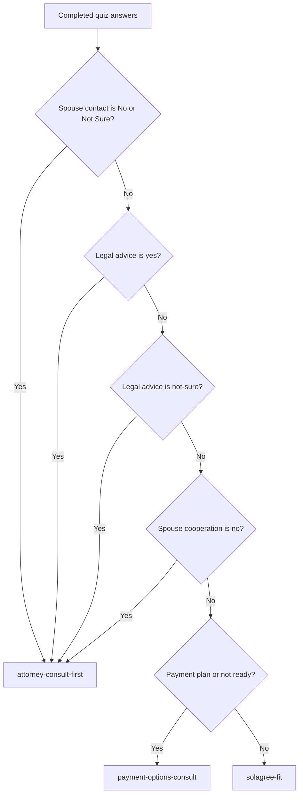

# Solagree Quiz Answers and Results Matrix

This document describes the current quiz behavior in the website code as of June 3, 2026.

Source files:

- `app/data/quiz-schema.ts` defines questions, answers, and conditional visibility.
- `app/utils/quiz-results.ts` defines final result routing.
- `app/data/quiz-policies.ts` defines policy-driven result mappings.
- `app/data/quiz-results.ts` defines the displayed result copy.

## Current Results

| Result ID | Displayed title | Primary CTA |
| --- | --- | --- |
| `solagree-fit` | You look like a fit for a Solagree consult. | Book a Solagree consult |
| `attorney-consult-first` | We recommend working with an advising attorney throughout the Solagree process. | Book an attorney consultation |
| `payment-options-consult` | You may have more options than you think. | Schedule an introductory consultation |
| `not-fit-right-now` | Solagree may not be the right fit right now. | Review general legal-help resources |

## Current Result Precedence

The quiz does not score answers. It checks conditions in this order and stops at the first match.

| Priority | Condition | Result |
| --- | --- | --- |
| 1 | `spouseContact = cannot-find` | `attorney-consult-first` |
| 2 | `spouseContact = unknown-whereabouts` | `attorney-consult-first` |
| 3 | `spouseContact = know-where-not-communicating` | `attorney-consult-first` |
| 4 | `legalAdvice = yes` | `attorney-consult-first` |
| 5 | `legalAdvice = not-sure` | `attorney-consult-first` |
| 6 | `spouseCooperation = no` | `attorney-consult-first` |
| 7 | `paymentReadiness = need-payment-plan` | `payment-options-consult` |
| 8 | `paymentReadiness = not-ready` | `payment-options-consult` |
| 9 | Any remaining completed path | `solagree-fit` |

Important: the visible `spouseContact` answers `No` and `Not Sure` both route to `attorney-consult-first`. The removed legacy value `know-where-not-communicating` also routes there for saved sessions.

## Decision Flow

## Question Matrix

| Question | Answer | Visible when | Direct result impact | Metadata impact |
| --- | --- | --- | --- | --- |
| Where will your divorce be filed? | Any state | Always | None | Stores selected state. Adds deferred policy ID `state-specific-result-messaging`, but this does not block or change the result. |
| Do you have children under 21? | Yes | Always | None | Enables parenting screener. |
| Do you have children under 21? | No | Always | None | Hides parenting screener and parenting details. |
| Do you need help working through parenting, custody, or child-support issues? | Yes | Only when children = yes | None | Adds tag `parenting`. If financial screener is also yes, adds tag `both`. |
| Do you need help working through parenting, custody, or child-support issues? | No | Only when children = yes | None | No result or tag impact. |
| Which parenting topics apply to your situation? | Any selected topic | Only when children = yes and parenting screener = yes | None | Stores selected parenting topic IDs. |
| Do you have financial questions about your divorce? | Yes | Always | None | Adds tag `financial`. If parenting concerns also exist, adds tag `both`. Enables financial details. |
| Do you have financial questions about your divorce? | No | Always | None | Hides financial details. |
| Which financial topics apply to your situation? | Any selected topic | Only when financial screener = yes | None | Stores selected financial topic IDs and adds tag `financial-complexity`. |
| Do you have contact information for your spouse (we will not ask you to provide it at this time)? | Yes / `direct-contact` | Always | Allows quiz to continue to spouse cooperation. No direct result. | Stores spouse contact. |
| Do you have contact information for your spouse (we will not ask you to provide it at this time)? | No / `cannot-find` | Always | `attorney-consult-first` | Adds tag `missing-spouse`. |
| Do you have contact information for your spouse (we will not ask you to provide it at this time)? | Not Sure / `unknown-whereabouts` | Always | `attorney-consult-first` | Adds tag `missing-spouse`. |
| Do you expect your spouse to cooperate in the divorce process? | Yes | Only when spouse contact = direct-contact | None | Stores spouse cooperation. |
| Do you expect your spouse to cooperate in the divorce process? | No | Only when spouse contact = direct-contact | `attorney-consult-first` | Adds tag `spouse-resistance`. |
| Do you expect your spouse to cooperate in the divorce process? | I am not sure yet | Only when spouse contact = direct-contact | None | Stores spouse cooperation. |
| Do you think you need legal advice before moving forward? | Yes | Always | `attorney-consult-first` | Adds tag `legal-advice-needed`. |
| Do you think you need legal advice before moving forward? | No | Always | None | Stores legal advice answer. |
| Do you think you need legal advice before moving forward? | I am not sure | Always | `attorney-consult-first` | Adds tag `legal-advice-needed`. |
| Do you have the ability to pay for a service to help you? | Yes, I am ready now | Always | `solagree-fit` if no higher-priority condition matched | Stores payment readiness. |
| Do you have the ability to pay for a service to help you? | I would need a payment plan | Always | `payment-options-consult` if no higher-priority condition matched | Adds tag `payment-plan`. |
| Do you have the ability to pay for a service to help you? | No, not right now | Always | `payment-options-consult` if no higher-priority condition matched | Stores payment readiness. |

## Not A Fit Conditions To Review

There are currently no visible quiz answers that produce `not-fit-right-now`.

The result copy is still configured in `app/data/quiz-results.ts` for future policy use.

## Attorney Consult First Conditions

These answers produce `attorney-consult-first` and take priority over the payment-options result:

| Trigger answer | Code value | Source |
| --- | --- | --- |
| Legal advice = Yes | `legalAdvice = yes` | `app/utils/quiz-results.ts` |
| Legal advice = I am not sure | `legalAdvice = not-sure` | `app/utils/quiz-results.ts` |
| Spouse cooperation = No | `spouseCooperation = no` | `app/utils/quiz-results.ts` |
| Spouse contact information = No | `spouseContact = cannot-find` | `app/data/quiz-policies.ts` |
| Spouse contact information = Not Sure | `spouseContact = unknown-whereabouts` | `app/data/quiz-policies.ts` |
| Spouse contact legacy no-contact value | `spouseContact = know-where-not-communicating` | `app/data/quiz-policies.ts` |

## Payment Options Consult Conditions

These answers produce `payment-options-consult` only when no higher-priority `attorney-consult-first` condition has already matched:

| Trigger answer | Code value | Source |
| --- | --- | --- |
| Payment readiness = I would need a payment plan | `paymentReadiness = need-payment-plan` | `app/utils/quiz-results.ts` |
| Payment readiness = No, not right now | `paymentReadiness = not-ready` | `app/utils/quiz-results.ts` |

## Solagree Fit Conditions

The quiz returns `solagree-fit` when:

- `spouseContact` is not `cannot-find`, `unknown-whereabouts`, or the legacy `know-where-not-communicating` value.
- Legal advice is not `yes` or `not-sure`.
- Spouse cooperation is not `no`.
- Payment readiness is not `need-payment-plan` or `not-ready`.

Only `paymentReadiness = ready-now` currently returns `solagree-fit` when the higher-priority conditions do not match.

## Notes For Tweaking

- Parenting answers currently do not affect the final result. They only collect metadata and topics.
- Financial answers currently do not affect the final result. They only collect metadata and topics.
- State currently does not affect the final result. It adds a deferred policy marker for future state-specific messaging.
- The current result routing is all-or-nothing by precedence. If an attorney-consult condition matches, later payment-readiness answers do not change the result.
